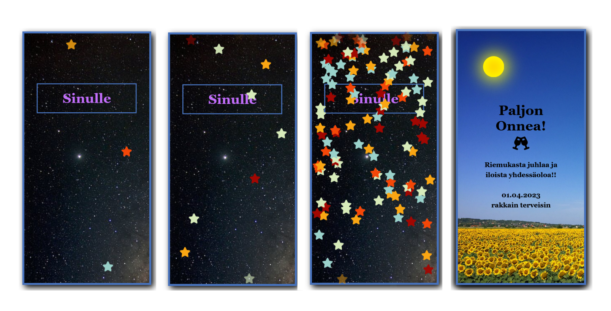

# Birthday Card

A birthday card with HTML, CSS and Javascript to make animation effects.¨

The card has two sides that flip over on tap (hover on computer, but it is meant to be viewed on phone).

CSS and JS can be incorporated directly to HTML file so the card can be sent over WhatsApp, for example.

## Description

The first page features an animation with JS Interval of falling stars, which speeds up gradually until a final massive starburst.

The second page is a simple image with an animated sun. On second tap, the view is resfreshed and returned to the first page and the star animation starts again.

## Preview

## Tools

>- HTML
>- CSS, no frameworks
>- JavaScript

## Sources

>- Photos from [www.pexels.com](www.pexels.com)
>- The sun is from [Jeff Hsu's codepen](https://codepen.io/hsfo3o/pen/BxXjyL). I added the keyframes animation.
>- I haven't worked much with CSS transitions, so [w3schools' flip card tutorial](https://www.w3schools.com/howto/howto_css_flip_card.asp) was useful.

## Author

kbastamow

